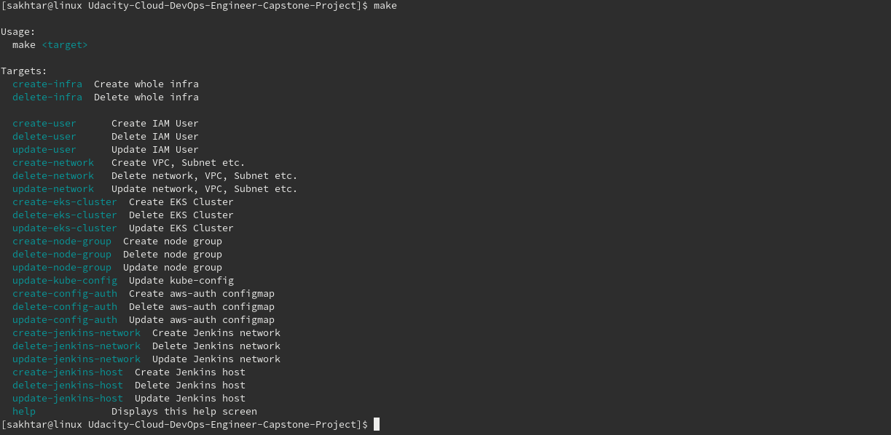

# Udacity Cloud DevOps Engineer Capstone Project

This is the final project to graducate at [Udacity Cloud DevOps Nanodegree](https://www.udacity.com/course/cloud-dev-ops-nanodegree--nd9991). The project requires to setup k8s cluster on AWS and deploy the dockerized app implementing CI/CD with Jenkins.

## Technology Used:
- EKS
- Jenkins
- Golang
- Docker
- Kubernetes
- CloudFormation
- Makefile
- Anchore inline scan for vulnerability
- hadolint for Dockerfile linting

## Prerequisite on control machine:
- aws-cli
- make

## Deployment

  * [Create Infra in AWS](doc/create-infra.md)
    
  * [Configure Jenkins host](doc/configure-jenkins-host.md)
  * [Create Pipeline from Jenkinsfile](doc/configure-jenkins-pipeline.md)

## Check List
## Set Up Pipeline:
  - [x] Create Github repository with project code.
  - [x] Use image repository to store Docker images
## Build Docker Container:
  - [x] Execute linting step in code pipeline
  - [x] Build a Docker container in a pipeline
## Successful Deployment:
  - [x] The Docker container is deployed to a Kubernetes cluster
  - [x] K8s Deployment Template
  - [x] Use Blue/Green Deployment or a Rolling Deployment successfully
  - [x] Screenshots
## Additional steps in CI:
  - [x] Perform additional CI steps in the pipeline outside of just linting
  - [x] Perform security scanning of the Docker containers
  - [x] Post-deployment add testing of your application
