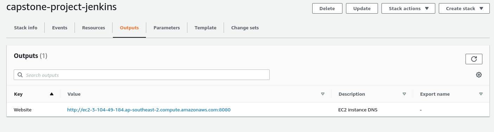
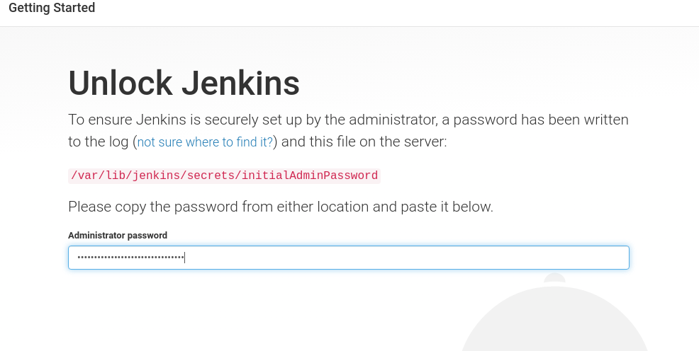
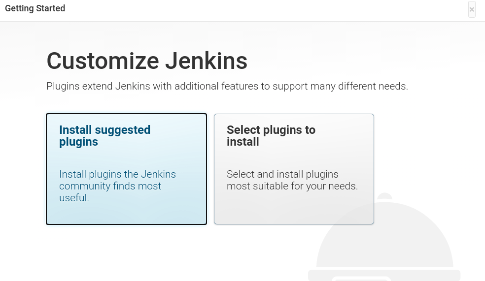
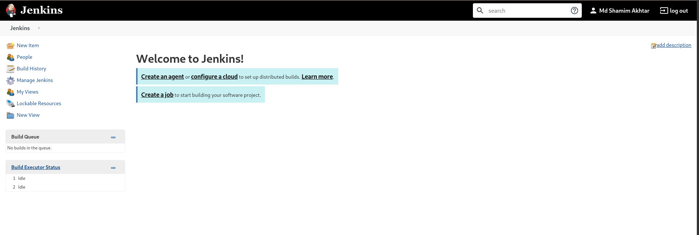

## Configure Jenkins Host

1. Grab the url from capstone-project-jenkins stack
   
2. Grab the passsword from jenkins host and paste here
   ```
   sudo cat /var/lib/jenkins/secrets/initialAdminPassword
   ```
   
3. Install Suggested plugin
   
4. Create First Admin User
5. Home page of jenkins
   
6. Install plugins: 
   Go to Manage Jenkins -->> Click on Manage plugins -->> Click Available tabs search below plugins and selct and install.
      - CloudBees AWS Credentials Plugin
      - BlueOcean Aggregator
      - Pipeline: AWS Steps
7. Enjoy !!
