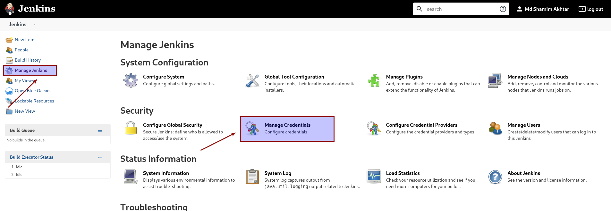
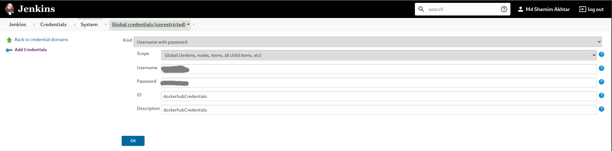
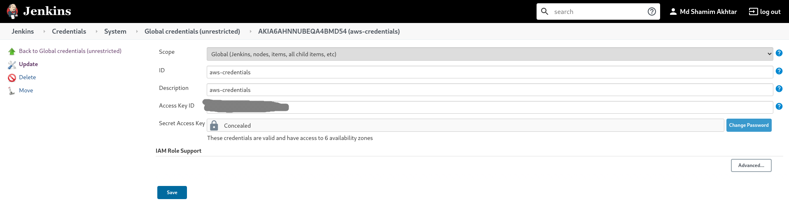
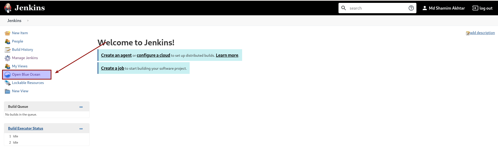
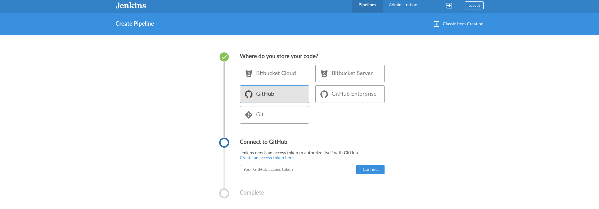
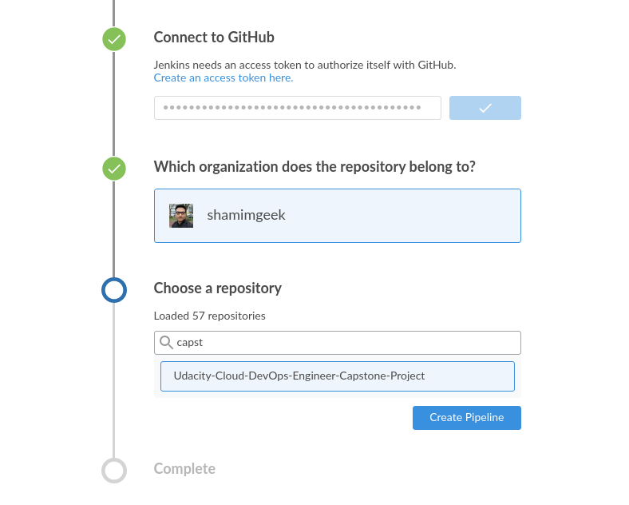

# Configure Jenkins Pipeline from the repo

1. Login to Jenkins with your admin user and pass
2. Create below credentials: Go to Manage jenkins --> Manage Credentials -- > click on global
   - dockerhubCredentials
   - aws-credentials
   
   
   

3. Create Pipeline integrate with github
   Click on Open Blue Ocean
   
   Select Github --> Click on Create an access token here -- > authenticate github --> give some name for token ---> Copy Token and paste in jenkins -- > select which organization does the repository belong to
   
   Select Repository and create pipeline.
   
4. Enjoy !!!
